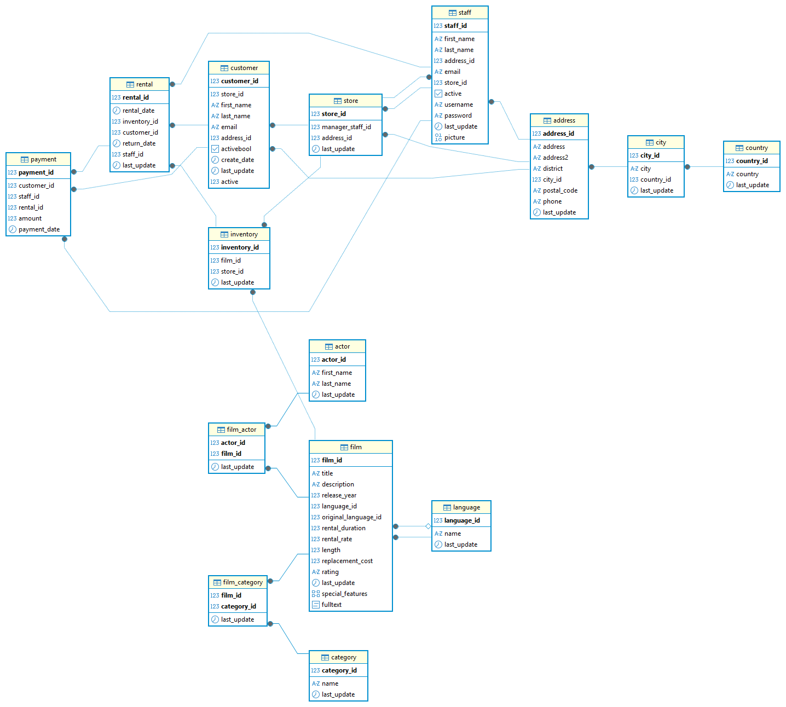

# 🎬 DataProject: Lógica. Consultas de SQL.
**Análisis de base de datos de películas**

---

## 1. Descripción del Proyecto
Este proyecto consiste en resolver un conjunto de consultas SQL sobre una base de datos de películas, actores, clientes e inventario de alquileres. El objetivo es practicar y demostrar habilidades en consultas complejas, agregaciones, joins, subconsultas y manejo de tablas temporales.

## 2. Estructura del Proyecto
├── esquema.sql         # Definición de tablas, relaciones y datos de ejemplo  
├── consultas.sql       # 64 consultas resueltas con comentarios en las más complejas  
├── diagrama.png        # Imagen del esquema de la base de datos  
└── README.md           # Descripción del proyecto

### 🧩 Esquema de la Base de Datos
A continuación se muestra el diagrama del modelo relacional usado en el análisis:

## 3. Instalación y Requisitos
- PostgreSQL 
- DBeaver

## 4. Resultados y Conclusiones
- Se identificaron las películas más largas y más populares según alquileres.
- Se detectaron actores con más participación en películas y clientes con mayor gasto.
- Se calcularon estadísticas como promedio, desviación estándar y varianza de costos de alquiler y reemplazo.
- Las consultas permiten analizar la disponibilidad de inventario, duración de alquileres y distribución de películas por categoría.

## 5. Próximos Pasos
- Ampliar el análisis incluyendo combinaciones más complejas entre categorías y actores.
- Añadir vistas o procedimientos almacenados para consultas frecuentes.

## 6. Contribuciones
Se aceptan sugerencias o mejoras en la legibilidad de las consultas.

## 7. Autores y Agradecimientos
👤 **Autor:** Samuel Delgado 
📊 [@samshinoda](https://github.com/samshinoda)